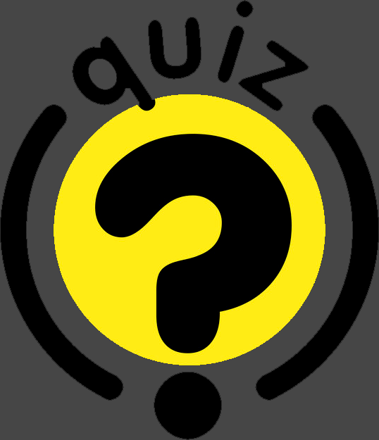

<!--
*** This is the Readme for the Password Generator
***  
-->

<!-- Project Shields -->

[![LinkedIn][linkedin-shield]][linkedin-url]

<!-- Project Logo -->
 

    <a href="https://aaguirre7.github.io/test_your_knowledge/">
        
    <a/>
    <h3 align="center">
        Test Your Knowledge Quiz
    </h3>
    

        A simple JS quiz
         
        <a href="https://github.com/aaguirre7/test_your_knowledge">
            <strong>Explore the docs</strong>
        </a>
         
         
        <a href="https://aaguirre7.github.io/test_your_knowledge/">
            View the site
        </a>
    

<!-- TABLE OF CONTENTS -->

  
Table of Contents

  <ol>
    <li>
      <a href="#about-the-project">About The Project</a>
    </li>
    <li>
        <a href="#contact">Contact</a>
    </li>

  </ol>

<!-- ABOUT THE PROJECT -->
## About The Project 

[![Product Name Screen Shot][product-screenshot]](./assets/images/screenshot.gif)

### User asked:

AS A coding boot camp student
I WANT to take a timed quiz on JavaScript fundamentals that stores high scores
SO THAT I can gauge my progress compared to my peers

### Criteria:

* GIVEN I am taking a code quiz
* WHEN I click the start button
* THEN a timer starts and I am presented with a question
* WHEN I answer a question
* THEN I am presented with another question
* WHEN I answer a question incorrectly
* THEN time is subtracted from the clock
* WHEN all questions are answered or the timer reaches 0
* THEN the game is over
* WHEN the game is over
* THEN I can save my initials and score

### What was done.

This project was mainly done using JS, for its functionality. there is a script for the questions and there is room to grow there. Also the quiz is valued over 100% that means that the puntuation is based on that. most of the code is comented and easy to read. kept the format as close to the demo that was given.  

Thank you for taking time looking at this page.

Happy painting!

(<a href="#top">back to top</a>)

<!-- CONTACT -->
## Contact

Abraham Aguirre Aguirre.Abraham@gmail.com

Project Link: [https://aaguirre7.github.io/test_your_knowledge/](https://aaguirre7.github.io/test_your_knowledge/)

<!-- MARKDOWN LINKS & IMAGES -->
[linkedin-shield]: https://img.shields.io/badge/-LinkedIn-black.svg?style=for-the-badge&logo=linkedin&colorB=555
[linkedin-url]: https://www.linkedin.com/in/abraham-aguirre-1b237293/
[product-screenshot]: ./assets/images/screenshot.gif